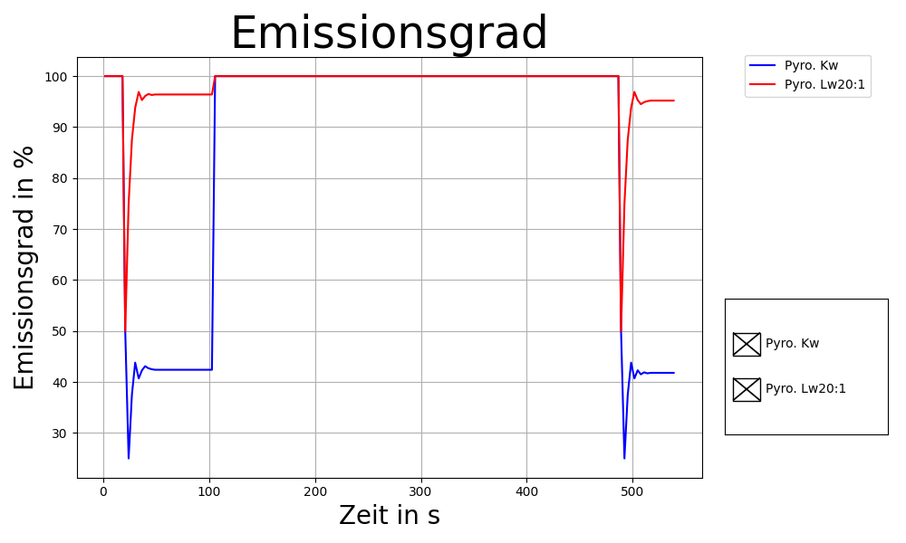

# exp-T-control
Scripts for controlling heating devices and temperature sensors.

This project is used to determine the emissivity of various materials. With the help of the pyrometer and the PT100 that are connected to the Adafruit, the emissivity should be determined. The PT1000 that is connected to the heating plate serves as a control sensor for the heating plate. 

The project is being processed by the Leibniz Institute for Crystal Growth (IKZ) and the [Model experiments group](https://www.ikz-berlin.de/en/research/materials-science/section-fundamental-description-1).
In particular by Dr. Pal, Josef and Funke, Vincent. 

See [this repository](https://github.com/nemocrys/exp-T-control-v2) for an updated version with further documentation.

---
## <u> 2. Introduction: </u> 

__Device programs:__

In the following table, the devices are assigned their programs. Each device has a specific set of commands that can be found in the operating instructions (Chapter 3). In chapter 4.3. you can look at the command set for the heating plate, and the link for the operating instructions for the heating plate can be found in Chapter 3. The operating instructions are then available in different languages. For the Pt100 that are attached to the Adafruit max31865, you need certain libraries to be able to read out the measured values. More on this in Chapter 5. 

Programs			|	 Related Device  
--------------------|------------------------
Heizplatte.py       |    IKA® C-MAG HS 7    
Pyrometer.py        |    IGA 6/23 – Laser     
Pyrometer_Array.py  |    Impac® Series 600  
Adafruit_PT100.py   |    Adafruit max31865 

__Other programs__:    
1. Hauptprogramm.py
     * Processes the measured values of the devices.
     * It saves the data and records it live.
2. Daten_Einlesen.py
     * The generated data can be read by the program and then converted back into a plot.
3. Erstelle_Emis_Anpassung.py
     * Creates the lower right diagram from the live plot
4. Vergleiche_Temp_Kurven.py
     * By user input of the path, several series of measurements can be compared with one another.
5. Vergleiche_Emis_Kurven.py
     * The emissivities are compared with the temperature using the file paths specified in the program.
6. Suche_Werte.py
     * Can create the "*Emis_Ende.txt". Was only important for old series of measurements, the currently generated series of measurements are already complete and no longer need this program. 

__Other devices:__    
1. You need a PT1000 or PT100 for the Adafruit max31865. We use three PT100.
2. The heating plate contains a PT1000 sensor. 
3. You also need a Raspberry Pi or similar. Depending on what you take, you have to adjust little things.  

__Files:__
1. *Init_Device.txt*  
    * initialization of the devices (heating plate and pyrometer) - specification of the interface designation
2. *Config_Rezept.txt*
    * heating process recipes
    * the name can be changed and is indicated by "-cfg " at the start of a run
    * Example_Datein - *Rezept_example.txt*      
3. *Configurationen.txt*    
    * There are presets inside.    
        * Legends names
        * Comparison device for determining emissivity     
            * only AD1, AD2, AD3 possible
    * *Config_Example.txt* is the example

These files are located in the "Example_Datein/Vom_Programm_Erstellt" folder and are intended to show how the files are structured that are used in the program. In addition, sample files of the created files are also in the folder. In chapter 6.2 there is often this: "* temp.txt"     
The asterisk stands for the date and the number. Only the end of the filename is shown. With the help of the example files you can understand the evaluation programs. 

The "* Emis.txt" is available once for a recipe and for a manual adjustment.

---

## 3. Operation manual:        
__Heating plate:__                     
https://www.ika.com/de/Produkte-Lab-Eq/Magnetruehrer-Heizruehrer-Laborruehrer-Ruehrer-csp-188/C-MAG-HS-7-control-Downloads-cpdl-20002694/             
On the side you can find the instruction manual in different languages.

__Pyrometer IGA 6/23:__  
https://www.disai.net/wp-content/uploads/catalogos_pdf/MI_en-op-iga6-23-advanced-manual.pdf        
in English

---

## <u>4. To the heating plate:</u>   
### <u>4.1. Set the safety temperature:</u>         
* to the left of the on / off switch
* A screwdriver (or similar) is required
* Adjustment range:  100 °C ... 650 °C       
-> The target temperature has a maximum size at certain safety temperatures (e.g. at 100 ° C the device only allows 50 ° C, regardless of what is sent to the device !!)        
-> See on the display of the device what is maximally possible !!
               
### <u>4.2. Adjust controller:</u>    
* possible controllers 
    * PID
    * 2P - Two-point controller       
* Before starting the program!!
* press the wrench symbol   
        -> then turn the right rotary control until the PID or 2P can be seen on the hardware screen         
        -> Press the rotary button once to confirm         
        -> when the display flashes, turn the rotary selector until the desired controller appears on the display      
        -> To enter, press the rotary knob again and press the symbol with the wrench to exit         

### <u>4.3. Existing functions:</u>        
1. Ask for values:
<pre>
    * Device names                           -->     IN_NAME\r\n
    * Actual temperature (external sensor)   -->     IN_PV_1\r\n 
    * Actual temperature (heating plate)     -->     IN_PV_2\r\n
    * Target temperature                     -->     IN_SP_1\r\n 
    * Safety temperature                     -->     IN_SP_3\r\n
</pre>
2. Passing values:
<pre>
    * Target temperature                     -->     OUT_SP_1 x\r\n                      Integer --> Bereich: x = 0 ... 500 °C       (Entry without unit)
    * Stop the heating                       -->     STOP_1\r\n
    * Start the heating                      -->     START_1\r\n
</pre>     
### <u>4.4. Other possible functions of the heating plate - not used here for the time being - not in the program:</u>     
1. Ask for values:
<pre>
    * Actual speed value                     -->     IN_PV_4\r\n
    * Viscosity trend                        -->     IN_PV_5\r\n
    * Speed setpoint                         -->     IN_SP_4\r\n
</pre>
2. Passing values:
<pre>
    * Speed setpoint                         -->     OUT_SP_4 x\r\n                      Integer --> Bereich: x = 0 ... 1500 rpm     (Eingabe ohne Einheit)
    * Start engine                           -->     START_4\r\n
    * Stop engine                            -->     STOP_4\r\n
    * Switch to normal operation             -->     RESET\r\n
    * Set the operating mode                 -->     SET_MODE_n\r\n                      n = A, B or D   --> See the instruction manual to see what it means!
</pre>  

---

## <u>5. To Adafruit and Raspberry Pi 400</u>    

Source: https://learn.adafruit.com/adafruit-max31865-rtd-pt100-amplifier/python-circuitpython     
This page was used for testing and for the later finished program.    

### <u>5.1. Installed:</u>
* sudo pip3 install adafruit-circuitpython-max31865

### <u>5.2. Due to an error, the following was done:</u>            
              
__Error__:   
platform.system(), package[0], package[1]
NotImplementedError: Adafruit-PlatformDetect version 3.15.3 was unable to identify the board and/or microcontroller running the Linux platform. Please be sure you have the latest packages running: 'pip3 install --upgrade adafruit-blinka adafruit-platformdetect'

First update the library shown in the error code:   
+ pip3 install --upgrade adafruit-blinka adafruit-platformdetect    

If that doesn't help:
1. **detect.py** carry out    
    * https://github.com/adafruit/Adafruit_Python_PlatformDetect/blob/main/bin/detect.py   
2. **cat /proc/cpuinfo** run in the console window   
    * The hardware and revision are in the last 4 lines of the answer
    * Revision: __c03131__
    * Hardware: BCM2711
3. Problem:   
    * Model of the board is missing in the libraries! 
    * E.g. the revision (it was like that with us!)
4. Call in the console window:   
    * With __"pip3 install --upgrade adafruit-blinka adafruit-platformdetect"__ you can see where the library is located
    * With us: /usr/local/lib/python3.7/dist-packages/adafruit_platformdetect/constants
    * Change to the folder with the console
    * Open **boards.py** with vi 
        + https://github.com/adafruit/Adafruit_Python_PlatformDetect/blob/main/adafruit_platformdetect/constants/boards.py 
        * https://www.fehcom.de/pub/viref.pdf (vi help)
    * Add the revision (if not already available) to your board and save the change!
    * Our Board: Raspberry Pi 400 

### <u>5.3. Our wiring:</u>   

### <u>5.4. Libraries:</u>
1. *import board*   
    * The CS-Pin (Chip Select) is indicated with D + GPIO number e.g. D16
2. *import digitalio*   
3. *import adafruit_max31865*   
    * adafruit_max31865.MAX31865(spi, cs, rtd_nominal=100, ref_resistor=430.0, wires=2)   
        * with rtd_nominal you can specify the resistance at 0 ° C   
            * PT1000 = 1000 Ohm
            * PT100 = 100 Ohm
                * https://learn.adafruit.com/adafruit-max31865-rtd-pt100-amplifier/f-a-q
        * at ref_resistor the reference resistance is given
            * PT1000 = 4300 Ohm
            * PT100 = 430 Ohm
        * with wires you specify the wiring
            * The default is __2__-wire cabling
            * There is still __3__ and __4__ conductor cabling
    * Details on:    
    https://learn.adafruit.com/adafruit-max31865-rtd-pt100-amplifier/python-circuitpython     
    https://learn.adafruit.com/adafruit-max31865-rtd-pt100-amplifier/rtd-wiring-config
--- 
## <u> 6. To the programs: </u>                
The programming language used is Python. 

### __6.1. The program *Hauptprogramm.py*:__
The program manages everything:
It creates the graphical interfaces and diagrams, it creates the various files and folders, it speaks to the devices and saves all of the measurement data. 

The user interface (GUI) reacts to user interrupts, i.e. as soon as a button is pressed, an interrupt is triggered, which interrupts the loop. The loop is generated by the library tkinter. With the command "after" from tkinter, a function or simply a sequence is carried out again and again after a certain time (here the sampling rate). The interrupts are triggered when this task has been fulfilled in "after". 

In the following picture you can see the function of the individual buttons:

On the left side of the picture is what happens at the beginning of the program, what happens after pressing Start in the "get_Measurment ()" function and what you have to pay attention to in the input fields. "get_Measurment ()" is the function that is called again and again by the "after" command (after -> task () -> get_Measurment () - if nStart = True). 

The program can be started normally from Python, Visual Studio Code or similar, or via the console of the program or via the console of PowerShell. In chapter 6.1.2. you can see the commands that you can enter via the console at the start. 

In the following chapters, the modes and the files created are explained. 

#### <u> 6.1.1. What can the program do: </u>    
1. Creates a button interface with buttons, input fields and selection boxes

2. The sampling rate of the measured values can be set in the GUI, the default value is 1000 ms and can be changed using the input command "-dt Dt".
3. Can change values such as emissivity, transmittance and setpoint temperature according to user input on the device (only possible in manual mode).
4. Can query values such as the safety temperature of the heating plate and pyrometer focus and display them on the switching surface.
5. The laser of the short-wave pyrometer can be switched on and off. 
6. A selection of the measuring devices is possible before the start (currently 7 devices - pyrometer and Pt100 on the Adafruit)
     - The pyrometer Kw. Quotient pyrometer has not yet been tested!
7. Plots the selected curves (see 6.1.3. Or 6.1.6.) And creates a file with the measured values
8. Instead of ending the program, you can also stop it
     - GUI does not close
     - Diagrams close
     - Device selection enabled again
     - A measurement begins with the start
     - __Attention__: Old settings in the configuration files (see Chapter 2.) are retained.  
9. It is possible to temporarily save the diagrams
10. Test, Debug and Log mode are available
11. Setpoint temperature can be specified with start (see 6.1.2.)
12. User-friendly entries and display of incorrect entries without exiting the program 
13. Heating recipes can be transferred to the program via files:
     * *zyn: target temperature, control range, time * (example line)
        * __Soll Temperatur__ - temperature to which the control is to take place
        * __Control range__ - Accepted range for the current cycle (fluctuations to the setpoint plus minus)
        * __Time__ - time in which the measured value should be in the control range, if the value remains in the range for the time, it jumps to the next cycle 
14. The initialization of the devices (heating plate and pyrometer) is now controlled via a file. This is to make it easier to change when using another computer. (Interface designation)
15. The images and text files are placed in a folder created by the program. The sub-folders are sorted by date!
16. The emissivity is automatically determined during a recipe when the control range is reached; in manual mode it can be started at any time using a button        
17. With an entry at the start of the program, the diagrams cannot be generated; this is done with the "-nogra" command. In this state, only measurement data are recorded and written to the respective files. The reason for the function is that the recording of the data is paused from time to time by the "figure.canvas.draw ()" and only continues through the interaction of the user.
18. With a button you can stop the updating of the diagrams. The button toggles between True and False.     
19. The emissivity is plotted in recipe mode and manual mode (if pyrometer is there).
    * Recipe mode (-cfg): The adaptation is started and ended automatically.
    * Manual mode: The adjustment is started and ended with a button.    
20. The selection of the devices influences the behavior of the program:
    * __The comparison device for determining the emissivity was not selected for the devices:__    
    --> The comparison device is the Pt1000 of the heating plate and the temperature of this Pt1000 is also used for adjustment / comparison.
    * __No pyrometers selected:__    
    --> The lower right picture in the live plot remains empty!
    * __No device selected:__    
    --> The upper right picture of the live plot is missing!   
    --> The lower right is empty   
    --> The adjustment is simply processed in manual and recipe mode. The files then only contain the target temperature, the comparison temperature and the times. Otherwise nothing happens !!!    
21. If the graphic is not updated live and the recipe is over, a new diagram is created with all measurement data inside, this is saved in addition to the frozen image.
22. There is a configuration file that specifies, for example, names for legends and etc. (see folder "Example_Files")   

#### **6.1.2. Console input commands:**

The following commands are entered in the console when the program is started. Combination of commands is possible. 

Example: python Hauptprogramm.py -cfg Textdatei.txt -nogra    
1. -h, --help
    * shows these messages and exits the program
2nd test
    * Test mode - without connected measuring devices
    * random numbers are returned as a measured value
    * Random values are also returned when adjusting the emissivity
    * Also works with a prescription
3. -debug
    * Debug mode - display of commands and data
    * The commands sent to the devices are also displayed in full
4. -dt DT
    * DT is the number you enter
    * Measurement data read out in milliseconds
    * Default = 1000 ms
5. -solltemp SOLLTEMP
    * SOLLTEMP is the value you enter
    * Values in ° C
6. -cfg CFG
    * CFG is the file you enter
    * E.g. - Config_Rezept_1.txt
    * Starts recipe mode
7. -nogra
    * The diagrams are not generated - measurement without diagrams
8. -log
    * With the command, the program logs certain events and others with a time stamp.    

#### **6.1.3. cfg - Mode (recipe mode) :**         
Heating recipes are processed in cfg mode. In this mode you can no longer change the emissivities and setpoint temperatures yourself.
The program works through the temperature levels in the specified range and the length of time the temperature is maintained and at the same time determines the emissivity.

In this mode, the "Anpassung"-button on the GUI is locked, as well as all other buttons messing up the values in the recipe (already mentioned above).

The values are in files and look like this: 

*   __Example:__   
[Heating]     
zy1: 50,0.5,20     
zy2: 100,0.5,20     
zy3: 150,0.5,20    
zy4: 200,0.5,20    
zy5: 250,0.5,20    
zy6: 300,0.5,20    
zy7: 250,0.5,20    

The following picture is intended to show a recipe flow, the picture fits the example shown. 

   

The picture was made into a gif with the help of a program from many individual pictures. In chapter 8.1. stands the source. The program for the creation was available from the source (the first program example on the page was used). In the program you can enter the speed of the picture change and the picture name. The file extension of the images used can also be set. But be careful - the pictures become a gif picture based on their name, so you have to pay attention to the file names. 

#### **6.1.4. Manual mode:**    
The manual mode is started simply with __"python.\Hauptrogramm.py"__ in the console window (but it depends on the console) or via the start button in the programming environment.

The adaptation/ comparison of the temperatures and the determination of the emissivity is started with the "Anpassung"-button. Since no recipe is read in in the background here, the temperature of the Pt1000 of the heating plate is entered as the target temperature, since the measurement can take place at any time.

The same diagrams and files are created in both modes. In addition, the emissivity, transmittance and target temperature can be entered manually in the GUI in manual mode. As soon as the button for the adjustment has been pressed, this can no longer be set as long as the adjustment is active!

If the comparison device is missing or not selected, the Pt1000 of the heating plate will take over the role (in both modes). The reason for this is that this sensor and the internal heating plate sensor are always included in the program. In chapter 6.1.1. point 20 also explains something about the appearance of the diagrams for certain selections. 

#### **6.1.5. Files created:** 
In total, the program creates three text files and one or two PNG files (unless you create between saved images). 

The files always begin with the date and then an index (# digit).  

1. 2021_10_14_ # 10_temp.txt
    * The temperature data of the measuring devices are in this file. With the pyrometers and Adafruit Pt100 it depends on the selection whether they are in the file.
2. 2021_10_14_ # 10_Emis.txt
    * The file contains the emission values ​​that are measured in each cycle. 16 values ​​per cycle.
3. 2021_10_14_ # 10_Emis_Ende.txt
    * The file only contains the emissivity when adjusting 16 times. This means that the adjusted value is noted with the target temperature.
4. 2021_10_14_ # 10_temp_Bild.png
    * The picture shows all the diagrams that are open. The program can generate 4 diagrams. If no Pt100 and pyrometer have been selected, the upper right picture is missing. The lower right image will be blank if no pyrometer has been selected. This means that the diagrams on the right do not have to appear completely.
    * The picture is saved when you press Stop or Exit.
    * The picture freezes when pressing "Graph I/O"
5. 2021_10_14_ # 10_temp_Bild_ # 01.png
    * If you click on ""Bild speichern!" presses the open diagram is saved. With each click during a measurement, the second number in the name increases by one.
6. 2021_10_15_ # 04_temp_Bild_Rezept_End.png
    * Is created when the live plot is frozen by pressing "Graph I/O". The entire diagram (file no. 5) is recreated and saved. This allows the graphic to run unobserved (without the graphic freezing by itself (see chapter 6.1.1. Point 17)) and a complete image is still saved!      

You can see such a picture below, this picture was created during a recipe. 

### 6.2. Evaluation programs: 
In all the programs the checkbox function of "from matplotlib.widgets import CheckButtons" is used. The source for this programming can be found in chapter 8.1. This means that curves can be made invisible. 

#### __6.2.1. The program *Daten_Einlesen.py*:__         
The program can be used to convert the data created by the **Hauptprogramm.py** back into a graphic.
Hauptprogramm.py creates a folder with the name "Bilder_und_Daten" and then sub-folders by date.
In this program you have to enter the name of the file and the folder name interactively.

The program can also plot the emissivities. But the file must exist for this.

When the program starts, the file and folder names are requested in the console window. The following is the text that the user can see:   
<pre>
Datein liegen in einem Unterordner von "Bilder_und_Daten"! 
Der Ordner Pfad Teil muss nicht mit angegeben werden!!

Dateiname (ohne Dateiende): 2021_10_18_#01_temp
Ordner Pfad (am Ende / setzen): Daten_vom_2021_10_18_Grafit/
Bilder_und_Daten/Daten_vom_2021_10_18_Grafit/2021_10_18_#01_temp.txt
Ist der Pfad richtig? J/N/E: j

Wollen sie sich auch die Emissionsgrade Graphisch anzeigen lassen? J/N/E: j
Bilder_und_Daten/Daten_vom_2021_10_18_Grafit/2021_10_18_#01_Emis_Ende.txt
Ist der Pfad richtig? J/N/E: j
</pre>
E stands for end - the program ends 

The program reads the following files:    
* *temp.txt    
* *Emis_Ende.txt

Example Pictures:    

#### __6.2.2. The program *Vergleiche_Temp_Kurven.py*:__

The program can be used to compare the temperature curves with one another.
You can specify any number of curves. However, with too many curves the diagram can become confusing. The checkbox has a fixed position and can no longer be read if there are too many curves.

When the program starts, the file and folder names are requested in the console window. The following is the text that the user can see: 
<pre>
Eingabe für den 1 Vergleichspartner:
Dateiname (ohne Dateiende): 2021_10_20_#01_temp
Ordner Pfad (am Ende / setzen): Daten_vom_2021_10_20/
../Bilder_und_Daten/Daten_vom_2021_10_20/2021_10_20_#01_temp.txt
Ist der Pfad richtig? J/N/E: j

Willst du eine weitere Datei einlesen? J/N: j

Eingabe für den 2 Vergleichspartner:
Dateiname (ohne Dateiende): 2021_10_20_#04_temp
Ordner Pfad (am Ende / setzen): Daten_vom_2021_10_20/
../Bilder_und_Daten/Daten_vom_2021_10_20/2021_10_20_#04_temp.txt
Ist der Pfad richtig? J/N/E: j

Willst du eine weitere Datei einlesen? J/N: j

Eingabe für den 3 Vergleichspartner:
Dateiname (ohne Dateiende): 2021_10_19_#01_temp
Ordner Pfad (am Ende / setzen): Daten_vom_2021_10_19/
../Bilder_und_Daten/Daten_vom_2021_10_19/2021_10_19_#01_temp.txt
Ist der Pfad richtig? J/N/E: j

Willst du eine weitere Datei einlesen? J/N: n
</pre>

The program reads the following files:    
* *temp.txt  

Example Picture:    
  

In the picture you can also see what happens in test mode. Every second random values are generated from a certain range. 

#### __6.2.3. The program *Vergleiche_Emis_Kurven.py*:__

The program can be used to compare the emissivities of different materials. There is a dictionary in the program that contains the material and the path. Besides entering the path there, you only need to start the program.  

The program reads the following files:    
* *Emis_Ende.txt 

Example Picture:     
 

#### __6.2.4. The program *Erstelle_Emis_Anpassung.py*:__ 

The program can be used to create the lower right image of the live graphics. The course of the emissivities over time is shown here. The file path must be specified in the program!     

The "*temp.txt" contains all points in time (relative and absolute time) at which measurements were made. If these are not found in the "*Emis.txt" file, a 100 is used, unless the adjustment is still running, in which case the last determined emissivity is used. This hold works over absolute time.
The "*Emis.txt" also always records the absolute time at which the area was left, this time is used to hold. 

It is very important that after each adjustment there is a final sentence, these are:
* "- - - Außerhalb des Bereiches"   
     * Is entered in recipe mode after leaving an area.
* "- - - Rezept ist abgeschlossen!"
     * Is entered in recipe mode when the recipe is ended.
* "- - - Anpassung ist abgeschlossen!"
     * Is entered in manual mode when the "Anpassung"-button is pressed again (Adaptation off) or "Beenden" is pressed. 

In manual mode you can also change the emissivity using the input field. This change is shown during the live plot in the diagram (bottom right), but is not noted.
The program "Erstelle_Emis_Anpassung.py" only creates the course of the adjustment, that is, when the button has been clicked!

The program reads the following files:    
* *Emis.txt 
* *temp.txt 

Example Picture:    
 

#### __6.2.5. Summary__:

Program                   | What is it doing?
--------------------------|-------------------------------------------------------------------
Hauptprogramm.py          | Creates everything and records the measurement data + live plot 
Daten_Einlesen.py         | Reads in only one measurement series and plots it again. You can also have the associated emissivities plotted. - User input in the console
Vergleiche_Temp_Kurven.py | Measurement series are read in and plotted against each other. - User input in the console
Vergleiche_Emis_Kurven.py | Certain data are read in and then the emissivities are plotted against the temperature.   
Erstelle_Emis_Anpassung.py| Generates the lower right image from the live plot.  

### __6.3. Additional program - *Suche_Werte.py*:__    

The program should find the comparison temperatures for the emissivity adjustment in "* temp.txt". This must be because the old series of measurements in "* Emis_Ende.txt" only contained the target temperature and not the surface temperature that is used for comparison!    
The program first looks in the "* Emis.txt" file for the times when the sixteenth emissivity adjustment took place. Then it looks for the times in the "* temp.txt" file and notes the surface / comparison temperature (here the temperature of the Adafruit 3). Finally the program reads the header and the values of the file "* Emis_Ende.txt" and inserts the header and the values into the file "* Emis_Ende_Korrekt.txt". This can then be read by the other programs like the other files.       
       
The file paths must be entered manually in the program and not via the console and all three files must be there. 

The program only served as an aid and due to adjustments in the program, the program is no longer necessary.

---
## <u>7. Problems:</u> 
### <u>7.1. With Heating Plate:</u>
The heating plate occasionally sends back empty strings as measured values. These are already intercepted by the program and output in the console window with a time stamp. 
In addition, it happened before a zero was returned during a series of measurements.     

The operating instructions for the heating plate state that the Pt1000 of the heating plate can only be operated up to 350 °C. When we wanted to regulate the heating plate to 400 °C, the heating plate started to switch off at approx. 360 °C.

### <u>7.2. With Pyrometer Lw:</u>
It can happen that the pyrometer returns a "n.o" instead of a measured value. These are also intercepted and ignored.  

### <u>7.3. With Plots and Raspberry Pi:</u>   
To plot diagrams in Python you need the matplotlib and numpy libraries.   
Unfortunately there are difficulties with the installation. For this reason I will explain here how I got it to run on the Raspberry Pi and where I got the information from.   

1. <u>*sudo pip3 install matplotlib*</u>    
    * __Error 1:__     
ImportError: numpy.core.multiarray failed to import
2. <u>*pip3 install -U numpy*</u>    
    * from: https://stackoverflow.com/questions/20518632/importerror-numpy-core-multiarray-failed-to-import     
    * __Error 2:__    
        IMPORTANT: PLEASE READ THIS FOR ADVICE ON HOW TO SOLVE THIS ISSUE!   
        
        Importing the numpy c-extensions failed. This error can happen for
        different reasons, often due to issues with your setup.
    
        ...

        Please carefully study the documentation linked above for further help.

        Original error was: libf77blas.so.3: cannot open shared object file: No such file or directory
3. <u>*sudo apt-get install libatlas-base-dev*</u>
    * from: https://numpy.org/devdocs/user/troubleshooting-importerror.html    
    * __Error 3:__    
    TypeError: Couldn't find foreign struct converter for 'cairo.Context'    
4. <u>*sudo apt-get install python3-gi-cairo*</u>     
    * from: https://github.com/rbgirshick/py-faster-rcnn/issues/221 
    * When you are on the website, there are many different versions of the command. The command depends on the version of Python and the operating system of the computer. 
        * sudo apt-get install python-gobject-cairo 
            * Message from the computer:   
            Paket python-gobject-cairo ist nicht verfügbar, wird aber von einem anderen Paket referenziert. Das kann heißen, dass das Paket fehlt, dass es abgelöst wurde oder nur aus einer anderen Quelle verfügbar ist.
        * sudo apt-get install python-gi-cairo 

### <u> 7.4. Other problems: </u>
There are other small problems in the program, but they have to do with the libraries and devices.

1. Test mode:
    - Test mode will not work properly if the libraries for the Adafruit are not properly available. Commenting out the library or the Adafruits also leads to problems.   
    -> Without a board and the correct installation of the library, the program causes problems!
    - But if everything is there, then it looks like this:

    

2. The quotient pyrometer:
    - As you can see in the picture, a curve for the pyrometer is generated in test mode.
    - The pyrometer was made by the same manufacturer as the other short-wave pyrometer, but does not necessarily seem to react to the same commands. E.g. this line: "Write_Pyro_Para (1, 't90', '7')".
    - On the other hand, the function of the pyrometer could not be fully tested in the program. The cooperation of the two pyrometers (controlled by Pyrometer.py) has not been tested either.
    - The same idea was used in the "Pyrometer.py" program as in "Adafruit_PT100.py". Since classes are not used here, each pyrometer has a permanent place in a list. This means that the correct pyrometer can always be determined using the index i.
    In addition, the pyrometers can be initialized in different order without having to change the index. This procedure has already been tried and tested with the Adafruit Pt100. E.g. if you only want to have the third Adafruit in the measurement, index 2 is assigned to it and the program can execute the other commands with the index. The first two list positions are then assigned a zero and can be added later if you want another (after pressing Stop). 

---

## <u>8. Sources:</u>
### <u>8.1. Program sources:</u>
__Hauptprogramm.py__     
Integrate the graphic or the diagram:             
https://www.delftstack.com/de/howto/matplotlib/how-to-automate-plot-updates-in-matplotlib/         

For tkinter you can use:   
https://pythonbuch.com/gui.html -          

Folder creation:    
https://www.delftstack.com/de/howto/python/python-create-directory/

Logging:     
https://docs.python.org/3/howto/logging.html      

__Evaluation programs:__     
For plot check buttons:    
https://matplotlib.org/3.1.0/gallery/widgets/check_buttons.html

For the positioning of legends:    
https://www.physi.uni-heidelberg.de/Einrichtungen/AP/python/xyDiagramme.html    
https://www.delftstack.com/de/howto/matplotlib/how-to-place-legend-outside-of-the-plot-in-matplotlib/

__Animated picture:__    
The following page was used to create a gif image from several images:     
https://pythonprogramming.altervista.org/png-to-gif/?doing_wp_cron=1634728204.5697550773620605468750

### <u>8.2. Image sources:</u>   
The picture by __Our wiring__ was put together from different pictures with paint:
1. Adafruit max31865 - https://learn.adafruit.com/adafruit-max31865-rtd-pt100-amplifier/python-circuitpython   
2. Bread-Board and Raspberry Pi 400 Pins - https://cdn-reichelt.de/documents/datenblatt/A300/BEGINNERSGUIDE-4THED-GER_V2.pdf (S. 121 & 133)
3. Legend and pin assignment - https://de.pinout.xyz/#

## Acknowledgements

[This project](https://nemocrys.github.io/) has received funding from the European Research Council (ERC) under the European Union's Horizon 2020 research and innovation programme (grant agreement No 851768).

