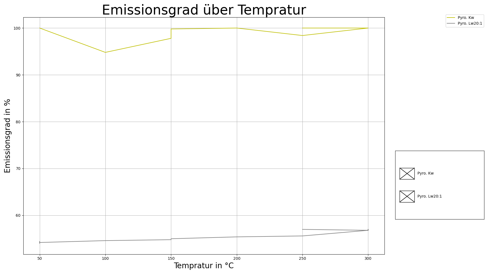
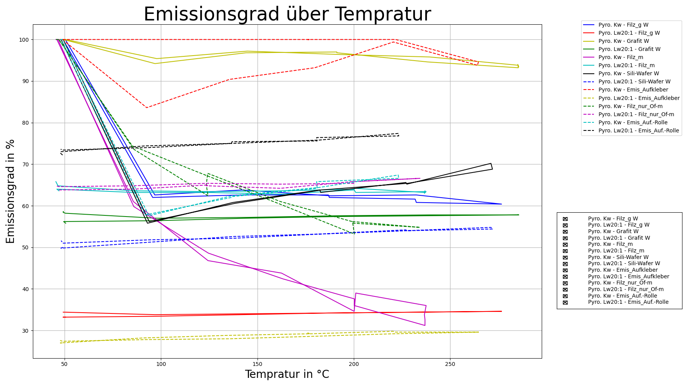

# exp-T-control
Scripts for temperature control.

## <u>1. Über uns:</u>
In diesem Projekt wird der Emissionsgrad verschiedener Materialien bestimmt. Mit Hilfe des Pyrometers und des PT100, die an die Adafruit angeschlossen sind, soll der Emissionsgrad bestimmt werden. Der an die Heizplatte angeschlossene PT1000 dient als Kontrollfühler für die Heizplatte.

Das Projekt wird von der Gruppe Modellexperimente am IKZ - Leibniz Institut für Kristallzüchtung bearbeitet.
Insbesondere von Dr. Pal, Josef und Funke, Vincent. 

---
## <u>2. Einführung:</u>    

__Geräte Programme:__    

In der folgenden Tabelle werden den Geräten ihre Programme zugeordnet. Jedes Gerät hat einen bestimmten Befehlssatz den man in der Betriebsanleitung (Kapitel 3) finden kann. In Kapitel 4.3. kann man sich den Befehlssatz für die Heizplatte ansehen, zudem befindet sich der Link für die Betriebsanleitung der Heizplatte in Kapitel 3. Auf dieser gibt es die Betriebsanleitung dann in verschiedenen Sprachen. Für die Pt100 die am Adafruit max31865 hängen brauch man bestimmte Bibliotheken um die Messwerte auslesen zu können. In Kapitel 5 mehr dazu. 

Datei		        |	bezogenes Gerät   
--------------------|------------------------
Heizplatte.py       |    IKA® C-MAG HS 7    
Pyrometer.py        |    IGA 6/23 – Laser     
Pyrometer_Array.py  |    Impac® Series 600
Adafruit_PT100.py   |    Adafruit max31865 

__Andere Programme__:    
1. Hauptprogramm.py
    * Verarbeitet die Messwerte der Geräte.     
    * Es speichert die Daten und zeichnet sie live auf.     
2. Daten_Einlesen.py 
    * Die generierten Daten können vom Programm gelesen und anschließend wieder in einen Plot umgewandelt werden.
3. Erstelle_Emis_Anpassung.py
    * Erstellt das rechte Untere Diagramm aus dem Live-Plot
4. Vergleiche_Temp_Kurven.py     
    * Durch Benutzer Eingabe des Pfades, können mehrere Messreihen mit ein ander Verglichen werden.
5. Vergleiche_Emis_Kurven.py     
    * Durch im Programm angegebene Datei-Pfade werden die Emissionsgrade über der Temperatur verglichen. 
6. Suche_Werte.py
    * Kann die "*Emis_Ende.txt" erstellen. War nur für alte Messreigen wichtig, die aktuell erzeugten Messreihen sind schon Komplett und brauchen dieses Programm nicht mehr.

__Andere Geräte:__    
1. Man brauch für den Adafruit max31865 einen PT100 oder PT1000 Sensor. Wir benutzen drei PT100.
2. Die Heizplatte beinhaltet einen PT1000 Sensor. 
3. man brauch außerdem einen Raspberry Pi oder ähnliche. Je nachdem was man benötigt, muss man kleine Dinge anpassen.   

__Datein:__
1. *Init_Device.txt*  
    * Initialisierung der Geräte (Heizplatte und Pyrometer) - Angabe der Schnittstellenbezeichnung 
2. *Config_Rezept.txt*
    * Rezepte/Abfolgen für einen Heizprozess
    * der Name kann geändert werden und wird durch die Eingabe mit "-cfg " zum Start eines Programmes eingelesen
    * Example_Datein - *Rezept_example.txt*     
3. *Configurationen.txt*    
    * Dort stehen Voreinstellungen drinnen.    
        * Legenden Namen
        * Vergleichsgerät für die Emissionsgrad Bestimmung    
            * nur AD1, AD2, AD3 möglich
    * *Config_Example.txt* ist das Beispiel

Diese Dateien liegen im Ordner "Example_Datein/Vom_Programm_Erstellt" und sollen zeigen wie die Dateien aufgebaut sind die im Programm verwendet werden. Zudem liegen auch Beispieldateien der erstellten Dateien in dem Ordner. Im Kapitel 6.2 gibt es oft dies: "*temp.txt"     
Das Sternchen steht für das Datum und die Ziffer. Nur das Ende des Dateinamens wird gezeigt. Mit Hilfe der Beispieldateien kann man die Auswertungsprogramme nach vollziehen. 

Die "*Emis.txt" gibt es einmal für ein Rezept und für eine Manuelle Anpassung.

---

## 3. Bedienungsanleitungen:        
__Heizplatte:__                     
https://www.ika.com/de/Produkte-Lab-Eq/Magnetruehrer-Heizruehrer-Laborruehrer-Ruehrer-csp-188/C-MAG-HS-7-control-Downloads-cpdl-20002694/             
Auf der Seite finden Sie die Bedienungsanleitung in verschiedenen Sprachen.

__Pyrometer IGA 6/23:__  
https://www.disai.net/wp-content/uploads/catalogos_pdf/MI_en-op-iga6-23-advanced-manual.pdf        
in Englisch

---

## 4. Zur Heizplatte:
### 4.1. Sicherheitstemperatur einstellen:         
* links neben dem Ein-Aus-Schalter
* Benötigt wird ein Schraubenzieher (oder ähnliches)
* Bereich:  100 °C ... 650 °C       
-> Solltemperatur hat bei bestimmten Sicherheitstemperaturen eine maximale Größe (z.B. bei 100 °C lässt das Gerät nur 50 °C zu egal was man dem Gerät sendet!!)      
-> Siehe dafür auf das Display des Gerätes, was maximal möglich ist!!
            
### 4.2. Regler einstellen:           
* Vor starten des Programms!!
* Mögliche Regler 
    * PID
    * 2P - Zweipunktregler 
* auf das Symbol mit dem Schraubenschlüssel drücken   
        -> dann den rechten Drehknopf drehen bis der PID oder 2P auf dem Hardware Bildschirm blickt         
        -> Drehknopf zur Bestätigung einmal drücken         
        -> wenn die Anzeige blinkt, Drehknopf drehen bis der gewünschte Regler auf dem Display erscheint      
        -> Zur Eingabe erneut den Drehknopf drücken und das Symbol mit dem Schraubenschlüssel zum Verlassen drücken          

### 4.3. Vorhandene Funktionen:        
1. Werte Erfragen:        
<pre>
    * Gerätenamen                       -->     IN_NAME\r\n
    * Isttemperatur (Externer Fühler)   -->     IN_PV_1\r\n 
    * Isttemperatur (Heizplatte)        -->     IN_PV_2\r\n
    * Solltemperatur                    -->     IN_SP_1\r\n 
    * Sicherheitstemperatur             -->     IN_SP_3\r\n

</pre>
2. Werte Übergeben:

<pre>
    * Solltemperatur                    -->     OUT_SP_1 x\r\n                      Integer --> Bereich: x = 0 ... 500 °C       (Eingabe ohne Einheit)
    * Stoppe die Heizung                -->     STOP_1\r\n
    * Starte die Heizung                -->     START_1\r\n
</pre>     
### 4.4. Weitere mögliche Funktionen der Heizplatte - hier Erstmal nicht gebraucht - Nicht im Programm:     
1. Erfragen:
<pre>
    * Drehzahl Istwert                  -->     IN_PV_4\r\n
    * Viskositätstrend                  -->     IN_PV_5\r\n
    * Drehzahl Sollwert                 -->     IN_SP_4\r\n
</pre>
2. Werte Übergeben:
<pre>
    * Drehzahl Sollwert                 -->     OUT_SP_4 x\r\n                      Integer --> Bereich: x = 0 ... 1500 rpm     (Eingabe ohne Einheit)
    * Start Motor                       -->     START_4\r\n
    * Stoppe Motor                      -->     STOP_4\r\n
    * Normalbetrieb umschalten          -->     RESET\r\n
    * Betriebsart einstellen            -->     SET_MODE_n\r\n                      n = A, B or D   --> Siehe Betriebsanleitung um zu sehen was es bedeutet!
</pre>  

---

## 5. Zu Adafruit und Raspberry Pi 400       

Quelle: https://learn.adafruit.com/adafruit-max31865-rtd-pt100-amplifier/python-circuitpython     
Diese Seite wurde zum Testen und für das spätere fertige Programm verwendet.   

### 5.1. Installiert:
* sudo pip3 install adafruit-circuitpython-max31865

### 5.2. Auf Grund eines Fehlers wurde folgendes getan:                       
              
Fehler:     
platform.system(), package[0], package[1]
NotImplementedError: Adafruit-PlatformDetect version 3.15.3 was unable to identify the board and/or microcontroller running the Linux platform. Please be sure you have the latest packages running: 'pip3 install --upgrade adafruit-blinka adafruit-platformdetect'

Als erstes die im Fehler-Code gezeigte Bibliothek aktualisieren:   
+ pip3 install --upgrade adafruit-blinka adafruit-platformdetect    

Wenn das nicht hilft:
1. **detect.py** ausführen       
    * https://github.com/adafruit/Adafruit_Python_PlatformDetect/blob/main/bin/detect.py   
2. **cat /proc/cpuinfo** im Konsolenfenster ausführen   
    * In den letzten 4 Zeilen der Antwort stehen die Hardware und Revision
    * Revision: __c03131__
    * Hardware: BCM2711
3. Problem:   
    * Modell des Boards fehlt in den Bibliotheken! 
    * z.B. die Revision (war bei uns so!)
4. Aufruf im Konsolenfenster:   
    * Durch "pip3 install --upgrade adafruit-blinka adafruit-platformdetect" kann man sehen wo die Bibliothek liegt
    * Bei uns: /usr/local/lib/python3.7/dist-packages/adafruit_platformdetect/constants
    * Wechsel in den Ordner mit der Konsole
    * Öffne **boards.py** mit vi 
    * https://www.fehcom.de/pub/viref.pdf (vi Hilfe)
    * Füge die Revision (wenn nicht schon vorhanden) bei deinem Board hinzu und speicher die Änderung!
    * Unser Board: Raspberry Pi 400 

### 5.3. Unsere Verdrahtung:    

### 5.4. Bibliotheken:
1. import board   
    * Der CS-Pin (Chip Select) wird mit D + GPIO Zahl angegeben z.B. D16
2. import digitalio   
3. import adafruit_max31865   
    * adafruit_max31865.MAX31865(spi, cs, rtd_nominal=100, ref_resistor=430.0, wires=2)   
        * bei rtd_nominal kann man den Widerstand bei 0°C angeben    
            * PT1000 = 1000 Ohm
            * PT100 = 100 Ohm
        * bei ref_resistor wird der Referenz Widerstand angegeben
            * PT1000 = 4300 Ohm
            * PT100 = 430 Ohm
        * bei wires gibt man an die Verdrahtung an
            * Default ist __2__-Leiter Verkabelung
            * Es gibt noch __3__ und __4__ Leiter Verkabelung
    * Näheres auf:       
    https://learn.adafruit.com/adafruit-max31865-rtd-pt100-amplifier/python-circuitpython     
    https://learn.adafruit.com/adafruit-max31865-rtd-pt100-amplifier/rtd-wiring-config
--- 
## <u>6. Zu den Programmen:</u>               
Die verwendete Programmsprache ist Python. 

### 6.1. Das Programm *Hauptprogramm.py*:    
Das Programm verwaltet alles:    
Es erzeugt die Grafischen Oberflächen und Diagramme, es erstellt die verschiedenen Files und Ordner, es spricht mit den Geräten und speichert die ganzen Messdaten.

Die Schaltoberfläche (GUI) reagiert über Interrupts des Benutzers, heißt sobald ein Knopf betätigt wird, wird ein Interrupt ausgelöst, wodurch die Schleife Unterbrochen wird. Die Schleife wird durch die Bibliothek tkinter erzeugt. Durch den Befehl "after" von tkinter wird eine Funktion oder einfach nur ein Ablauf nach einer bestimmten Zeit (hier die Abtastrate) immer wieder durchgeführt. Die Interrupts werden dann ausgelöst, wenn diese Aufgabe in "after" erfüllt wurde. 

Im folgenden Bild kann man die Funktion der Einzelnen Knöpfe sehen:

Auf der Linken Seite des Bildes, steht was zu Beginn des Programms passiert, was nach Betätigung von Start in der Funktion "get_Measurment()" passiert und was man bei den Eingabefeldern beachten muss. "get_Measurment()" ist die Funktion die in durch den "after" Befehl immer wieder aufgerufen wird (after --> task() --> get_Measurment() - Wenn nStart = True).   

Das Programm kann aus Python, Visual Studio Code oder ähnlichen normal gestartet werden, oder über die Konsole des Programms oder über die Konsole von PowerShell. In Kapitel 6.1.2. kann man die Befehle sehen die man über die Konsole zum Start mit eingeben kann. 

In den Folgenden Kapiteln, werden die Modi und die erstellten Dateien erläutert.

#### <u>6.1.1. Was kann das Programm alles machen:</u>   
1. Erstellt eine Schaltoberfläche mit Knöpfen, Eingabefeldern und Auswahlboxen

   

2. Die Abtastrate der Messwerte ist in der GUI einstellbar, der Default Wert liegt bei 1000 ms und kann über den Eingabebefehl "-dt Dt" verändert werden.  
3. Kann Werte wie Emissionsgrad, Transmissionsgrad und Sollwerttemperatur nach Eingabe des Benutzers am Gerät ändern (Nur im Manuellen Modus möglich).
4. Kann Werte wie Sicherheitstemperatur der Heizplatte und Pyrometer-Fokus erfragen und auf der Schaltoberfläche anzeigen.
5. Der Laser der Kurzwelligen Pyrometers kann Ein und Aus geschaltet werden.
6. Eine Auswahl der Messgeräte ist vor dem Start möglich (Derzeitig 7 Geräte - Pyrometer und Pt100 am Adafruit)     
    - Das Pyrometer Kw. Quotientenpyrometer wurde noch nicht getestet!!
7. Plottet die ausgewählten Kurven (siehe 6.1.3. oder 6.1.6.) und erstellt eine Datei mit den Messwerten
8. Anstatt das Programm zu Beenden kann man es auch Stoppen 
    - GUI schließt sich nicht
    - Diagramme schließen sich 
    - Geräte Auswahl wieder Freigeschaltet
    - Mit Start beginnt eine Messung 
    - __Achtung__: Alte Einstellungen in den Configurations Dateien (siehe Kapitel 2.) bleiben bestehen.
9. Zwischen speichern der Diagramme ist möglich
10. Test, Debug und Log Modus sind verfügbar
11. Solltemperatur kann mit Start angegeben werden (siehe 6.1.2.)
12. Benutzerfreundliche Einträge und Anzeige von fehlerhaften Eingaben ohne das Programm zu beenden
13. Heizrezepte können über Dateien an das Programm übergeben werden:   
    * *zyn: Solltemperatur,Regelbereich,Zeit* (Beispiel Zeile)
        * __Solltemperatur__ - Temperatur auf die geregelt werden Soll
        * __Regelbereich__ - Akzeptierter Bereich für den aktuellen Zyklus (Schwankungen zum Sollwert Plus Minus)
        * __Zeit__ - Zeit in der der Messwert in dem Regelbereich sein soll, wenn der Wert in dem Bereich bleibt für die Zeit, so springt er in den nächsten Zyklus
14. Die Initialisierung der Geräte (Heizplatte und Pyrometer) wird nun über eine Datei geregelt. Dies dient der besseren Änderbarkeit, wenn man einen anderen Computer nutzt. (Schnittstellen Bezeichnung)
15. Die Bilder und Text-Dateien werden in einem vom Programm erstellten Ordner gelegt. Die Unterordner werden nach Datum sortiert!
16. Der Emissionsgrad wird automatisch während eines Rezeptes bei erreichen des Regelbereiches bestimmt, im Manuellen Modus ist es jederzeit über einen Knopf zu starten
17. Mit einer Eingabe zum Start des Programms kann man die Diagramme nicht generieren lassen, dies geschieht mit dem Befehl "-nogra". In diesem Zustand werden nur Messdaten aufgenommen und in die jeweiligen Dateien geschrieben. Der Grund für die Funktion ist das die Aufnahme der Daten ab und zu durch das "figure.canvas.draw()" pausiert und erst durch interaktion des Benutzers weitergeht.   
18. Mit einem Knopf kann man die Aktualisierung der Diagramme stoppen. Der Knopf Toggelt zwischen True und False.   
19. Der Emissionsgrad wird im Rezept-Modus und Manuellen Modus (wenn Pyrometer da) geplottet.   
    * Rezept-Modus (-cfg):  Die Anpassung wird automatisch gestartet und beendet.   
    * Manueller-Modus: Die Anpassung wird über einen Knopf gestartet und beendet.
20. Die Auswahl der Geräte beeinflusst das Verhalten des Programms:   
    *   __Das Vergleichsgerät für die Bestimmung der Emissionsgrade wurde bei den Geräten nicht ausgewählt:__    
    --> Vergleichsgerät wird der Pt1000 der Heizplatte und auch die Temperatur dieses Pt1000 wird zur Anpassung/ zum Vergleich genommen.
    * __Keine Pyrometer ausgewählt:__   
    --> Das untere Rechte Bild im Live-Plot bleibt Leer!   
    * __Kein Gerät ausgewählt:__   
    --> Das obere Rechte Bild des Live-Plottes fehlt!    
    --> Das untere Rechte ist leer    
    --> Die Anpassung wird im Manuellen und Rezept Modus, einfach abgearbeitet. In den Dateien stehen dann nur die Solltemperatur, die Vergleichstemperatur und die Zeiten. Sonst passiert nichts!!!    
21. Wenn die Grafik nicht Live aktualisiert wird und das Rezept zu ende ist, wird ein neues Diagramm erstellt mit allen Messdaten drinnen, dies wird das zusätzlich zu dem Eingefrorenen Bild gespeichert.   
22. Es gibt eine Konfigurationsdatei die z.B. Namen für Legenden und etc. vorgibt. (sehe Ordner "Example_Dateien")

#### **6.1.2. Konsolen Eingabe Befehle:**    
Die folgenden Befehl werden mit dem Start des Programms in der Konsole eingegeben. Kombination der Befehle sind möglich. 

__Beispiel:__ python Hauptprogramm.py -cfg Textdatei.txt -nogra    

1. -h, --help    
    * zeigt diese Nachrichten und beendet das Programm
2. -test        
    * Test Modus - ohne angebundene Messgeräte    
    * zufällige Zahlen werden als Messwert zurückgegeben
    * Auch bei der Anpassung des Emissionsgrades, werden zufällige Werte zurückgegeben
    * Läuft auch mit Rezept
3. -debug     
    * Debug Modus - Anzeige der Befehle und Daten 
    * Auch die Befehle die an die Geräte gehen werden vollständig angezeigt
4. -dt DT     
    * DT ist die Zahl die man eingibt
    * Messdaten Auslese in Millisekunde
    * Default = 1000 ms
5. -solltemp SOLLTEMP
    * SOLLTEMP ist der Wert den du eingibst
    * Werte in °C
6. -cfg CFG     
    * CFG ist die Datei die du eingibst
    * Z.B. - Config_Rezept_1.txt   
    * Startet den Rezept-Modus 
7. -nogra    
    * Die Diagramme werden nicht erzeugt - Messung ohne Diagramme
8. -log   
    * Mit dem Befehl loggt das Programm bestimmte Ereignisse und anderes mit Zeitstempel. 

#### **6.1.3. cfg - Mode (Rezept-Modus):**    
Im cfg-Modus werden Heizrezepte abgearbeitet. In diesem Modus kann man dann nicht mehr selber die Emissionsgrade und Solltemperaturen ändern. 
Das Programm arbeitet die Temperaturstufen im angegebenen Bereich und der Länge des Haltens der Temperatur ab und bestimmt zugleich den Emissionsgrad. 

In dem Modus wird der "Anpassung"-Knopf auf der GUI verriegelt, sowie auch alle anderen Knöpfe die Werte im Rezept durcheinander bringen (oben schon erwähnt).

Die Werte stehen in Dateien und sehen wie folgt aus:

* __Beispiel:__    
[Heating]     
zy1: 50,0.5,20     
zy2: 100,0.5,20     
zy3: 150,0.5,20    
zy4: 200,0.5,20    
zy5: 250,0.5,20    
zy6: 300,0.5,20    
zy7: 250,0.5,20    

Das folgende Bild soll ein Ablauf eines Rezeptes zeigen, das Bild passt zum gerade gezeigten Beispiel. 

 

Das Bild wurde mithilfe eines Programms aus vielen einzelnen Bildern zu einen Gif gemacht. In Kapitel 8.1. steht die Quelle. Das Programm zur Erstellung stand aus der Quelle (das erste Programmbeispiel auf der Seite wurde genutzt). In dem Programm kann man die Geschwindigkeit des Bildwechsels und den Bildnamen eingeben. Die Dateiendung der verwendeten Bilder kann man auch einstellen. Aber Achtung - die Bilder werden anhand ihres Namens zu einen Gif Bild, mann muss die dateinamen also beachten.

#### **6.1.4. Manueller-Modus:**    
Den Manuellen Modus startet man einfach mit __"python .\Hauptprogramm.py"__ im Konsolenfenster (kommt aber auf die Konsole an) oder über den Start Knopf in der Programmierumgebung.    

Die Anpassung/ der Vergleich der Temperaturen und die Bestimmung des Emissionsgrades wird durch den "Anpassung"-Knopf gestartet. Da hier aber kein Rezept im Hintergrund eingelesen wird, wird als Solltemperatur die Temperatur des Pt1000 der Heizplatte eingetragen, da die Messung zu jedem Zeitpunkt geschehen kann. 

In beiden Modi werden die selben Diagramme und Files erstellt. Zudem kann man im Manuellen Modus die Emissionsgrade, Transmissionsgrade und die Solltemperatur manuell eingeben in der GUI. Sobald der Knopf für die Anpassung betätigt wurde, kann man dies nicht mehr einstellen solange die Anpassung aktiv ist!

Sollte das Vergleichsgerät fehlen oder nicht ausgewählt worden sein, so wird der Pt1000 der Heizplatte die Rolle übernehmen (in beiden Modi). Der Grund dafür ist das dieser Sensor sowie der interne Heizplatten Sensor immer im Programm dabei sind. In Kapitel 6.1.1. im Punkt 20 wird auch etwas zu dem Erscheinen der Diagramme bei bestimmten Auswahlen erklärt. 

#### **6.1.5. Erstellte Dateien:** 
Insgesamt erzeugt das Programm drei Textdateien und ein bis zwei PNG-Dateien (Außer man erzeugt sich zwischen gespeicherte Bilder).

Die Dateien beginnen immer mit dem Datum und dann ein Index (# Ziffer).

1. 2021_10_14_#10_temp.txt 
    * In dieser Datei liegen die Temperaturdaten der Messgeräte. Bei den Pyrometern und Adafruit Pt100 kommt es auf die Auswahl an ob sie in der Datei stehen.   
2. 2021_10_14_#10_Emis.txt    
    * In der Datei stehen die Emissionswerte die in jedem Zyklus gemessen werden. Je Zyklus 16 Werte.   
3. 2021_10_14_#10_Emis_Ende.txt    
    * In der Datei stehen nur der Emissionsgrad beim 16 mal anpassen. Das heißt der angepasste Wert wird mit der Solltemperatur und Vergleichstemperatur notiert.    
4. 2021_10_14_#10_temp_Bild.png 
    * Das Bild zeigt alle Diagramme die offen sind. Das Programm kann 4 Diagramme erzeugen. Wenn kein Pt100 und Pyrometer ausgewählt wurde, fehlt das obere Rechte Bild. Das rechte untere Bild wird Leer sein, wenn kein Pyrometer ausgewählt wurde. Heißt die Rechten Diagramme müssen nicht vollständig erscheinen. 
    * Das Bild wird beim drücken von Stopp oder Beenden gespeichert. 
    * Das Bild friert ein beim Betätigen von "Graph I/O"
5. 2021_10_14_#10_temp_Bild_#01.png
    * Wenn man an auf "Bild speichern!" drückt wird das offene Diagramm gespeichert. Mit jedem Klick während einer Messung erhöht sich die Zweite Nummer im Namen um eins. 
6. 2021_10_15_#04_temp_Bild_Rezept_End.png        
    * Wird erstellt wenn der Live-Plott durch das betätigen von "Graph I/O" eingefroren ist. Das gesamte Diagramm (Datei Nr. 5) wird neu erstellt und gespeichert. Dadurch kann man die Grafik unbeobachtet laufen lassen (ohne das die Grafik von selbst einfriert (siehe Kapitel 6.1.1. Punkt 17)) und es wird trotzdem ein Vollständiges Bild gespeichert!

Folgend kann man ein solches Bild sehen, dieses Bild wurde während eines Rezeptes erstellt. 

### 6.2. Auswertungsprogramme:
In all den Programmen wird die Checkbox Funktion von "from matplotlib.widgets import CheckButtons" genutzt. In Kapitel 8.1 kann man die Quelle für diese Programmierung finden. Dadurch kann man Kurven unsichtbar machen. 

#### 6.2.1. Das Programm *Daten_Einlesen.py*:
Mit dem Programm kann man die erstellten Daten vom **Hauptprogramm.py** wieder in eine Grafik umwandeln.   
Hauptprogramm.py erstellt einen Ordner mit dem Namen "Bilder_und_Daten" und darin dann Unterordner nach Datum.
In diesem Programm muss man dann interaktiv den Namen der Datei und den Ordner Namen eingeben. 

Außerdem kann das Programm auch die Emissionsgrade plotten. Dafür muss die Datei aber existieren.

Beim Start des Programms werden im Konsolenfenster die Datei- und Ordnernamen abgefragt. Folgend wird der Text gezeigt den der Benutzer zusehen bekommt:

<pre>
Dateien liegen in einem Unterordner von "Bilder_und_Daten"! 
Der Ordner Pfad Teil muss nicht mit angegeben werden!!

Dateiname (ohne Dateiende): 2021_10_18_#01_temp
Ordner Pfad (am Ende / setzen): Daten_vom_2021_10_18_Grafit/
Bilder_und_Daten/Daten_vom_2021_10_18_Grafit/2021_10_18_#01_temp.txt
Ist der Pfad richtig? J/N/E: j

Wollen sie sich auch die Emissionsgrade Graphisch anzeigen lassen? J/N/E: j
Bilder_und_Daten/Daten_vom_2021_10_18_Grafit/2021_10_18_#01_Emis_Ende.txt
Ist der Pfad richtig? J/N/E: j
</pre>

E steht für Ende - Programm beendet sich

Das Programm liest folgende Dateien ein:    
* *temp.txt    
* *Emis_Ende.txt    

Beispiel Bilder:    

#### __6.2.2. Das Programm *Vergleiche_Temp_Kurven.py*:__

Mit dem Programm kann man die Temperaturkurven miteinander vergleichen.    
Man kann beliebig viele Kurven angeben. Mit zu vielen Kurven kann das Diagramm aber unübersichtlich werden. Die Checkbox hat eine feste Position und ist bei zu vielen Kurven nicht mehr lesbar. 

Beim Start des Programms werden im Konsolenfenster die Datei- und Ordnernamen abgefragt. Folgend wird der Text gezeigt den der Benutzer zusehen bekommt:
<pre>
Eingabe für den 1 Vergleichspartner:
Dateiname (ohne Dateiende): 2021_10_20_#01_temp
Ordner Pfad (am Ende / setzen): Daten_vom_2021_10_20/
../Bilder_und_Daten/Daten_vom_2021_10_20/2021_10_20_#01_temp.txt
Ist der Pfad richtig? J/N/E: j

Willst du eine weitere Datei einlesen? J/N: j

Eingabe für den 2 Vergleichspartner:
Dateiname (ohne Dateiende): 2021_10_20_#04_temp
Ordner Pfad (am Ende / setzen): Daten_vom_2021_10_20/
../Bilder_und_Daten/Daten_vom_2021_10_20/2021_10_20_#04_temp.txt
Ist der Pfad richtig? J/N/E: j

Willst du eine weitere Datei einlesen? J/N: j

Eingabe für den 3 Vergleichspartner:
Dateiname (ohne Dateiende): 2021_10_19_#01_temp
Ordner Pfad (am Ende / setzen): Daten_vom_2021_10_19/
../Bilder_und_Daten/Daten_vom_2021_10_19/2021_10_19_#01_temp.txt
Ist der Pfad richtig? J/N/E: j

Willst du eine weitere Datei einlesen? J/N: n
</pre>

Das Programm liest folgende Dateien ein:    
* *temp.txt 

Beispiel Bild:     
       

In dem Bild kann man zudem sehen was im Test-Modus geschieht. Es werden jede Sekunde zufällige Werte aus einen bestimmten Bereich generiert. 

#### __6.2.3. Das Programm *Vergleiche_Emis_Kurven.py*:__

Mit dem Programm kann man die Emissionsgraden von verschiedenen Materialien Vergleichen. Im Programm gibt es ein Dictionarie, dass das Material und den Pfad beinhaltet. Außer den Pfad dort einzutragen brauch man nur das Programm zu starten.

Das Programm liest folgende Dateien ein:    
* *Emis_Ende.txt

Beispiel Bild:     
  

#### __6.2.4. Das Programm *Erstelle_Emis_Anpassung.py*:__ 

Mit dem Programm kann man sich das untere rechte Bild der Live-Grafik erstellen lassen. Hier wird der Verlauf der Emissionsgrade über die Zeit dargestellt. Der Datei Pfad muss im Programm angegeben werden!!

In der "*temp.txt" stehen alle Zeitpunkte (relative und absolute Zeit) an den gemessen wurde. Wenn diese nicht in der "*Emis.txt" Datei gefunden werden, so wird eine 100 eingesetzt, es sei denn, die Anpassung läuft noch, dann wird der letzte bestimmte Emissionsgrad eingesetzt. Dieses halten funktioniert über die absolute Zeit. 
Aus der "*Emis.txt" wird auch immer die absolute Zeit, bei der der Bereich verlassen wurde notiert, diese Zeit wird zum halten verwendet. 

Ganz wichtig ist das nach jeder Anpassung ein Abschluss Satz kommt, diese sind:    
* "- - - Außerhalb des Bereiches"           
    * Wird im Rezept-Modus nach Verlassen eines Bereiches eingetragen.
* "- - - Rezept ist abgeschlossen!"    
    * Wird im Rezept-Modus bei Beendigung des Rezeptes eingetragen.
* "- - - Anpassung ist abgeschlossen!"               
    * Wird im Manuellen Modus eingetragen wenn der "Anpassung"-Knopf erneut gedrückt wird (Anpassung Aus) oder "Beenden" gedrückt wird.

Im Manuellen Modus kann man den Emissionsgrad auch per Eingabefeld ändern. Diese Änderung wird während des Live-Plottes im Diagramm (unten rechts) mit gezeigt, jedoch nicht notiert. 
Das Programm "Erstelle_Emis_Anpassung.py" erstellt lediglich den Verlauf der Anpassung, heißt wenn der Knopf dafür betätigt wurde!

Das Programm liest folgende Dateien ein:    
* *Emis.txt
* *temp.txt

Beispiel Bild:     
 

#### __6.2.5. Zusammenfassung__:

Programm                  | Was tut es?
--------------------------|-------------------------------------------------------------------
Hauptprogramm.py          | Erstellt alles und nimmt die Messdaten auf + Live-Plot
Daten_Einlesen.py         | Liest nur eine Messreihe ein und plotten diese erneut. Zudem kann man sich die dazugehörigen Emissionsgrade plotten lassen. - Benutzereingaben in der Konsole
Vergleiche_Temp_Kurven.py | Messreihen werden eingelesen und gegeneinander geplottet. - Benutzereingaben in der Konsole
Vergleiche_Emis_Kurven.py | Bestimmte Daten werden eingelesen und dann werden die Emissionsgrade über der Temperatur geplottet.
Erstelle_Emis_Anpassung.py| Erzeugt das untere rechte Bild aus dem Live-Plot.

### __6.3. Zusatz Programm - *Suche_Werte.py*:__   
Das Programm sollte die Vergleichstemperaturen für die Emissionsgradanpassung im "*temp.txt" finden. Dies muss es da alte Messreihen im "*Emis_Ende.txt" nur die Solltemperatur beinhalteten und nicht die Oberflächentemperatur die zum Vergleich dient!     
Das Programm sucht zunächst in der "*Emis.txt" Datei nach den Zeiten, wann die sechzehnte Emissionsgradanpassung stattfand. Danach sucht es in der "*temp.txt" Datei nach den Zeiten und notiert sich die Oberflächen-/Vergleichstemperatur (hier die Temperatur vom Adafruit 3). Zuletzt liest das Programm den Kopf und die Werte der Datei "*Emis_Ende.txt" und fügt den Kopf und die Werte in die Datei "*Emis_Ende_Korrekt.txt". Diese kann dann wie die anderen Files von den anderen Programmen gelesen werden.

Die Dateipfade müssen per Hand im Programm und nicht über die Konsole eingegeben werden und es müssen alle drei Dateien da sein.

Das Programm diente nur als Hilfe und durch Anpassungen im Programm ist das Programm nicht mehr Notwendig.

---
## <u>7. Probleme:</u> 
### <u>7.1. Mit der Heizplatte:</u>
Die Heizplatte sendet ab und zu Leere Strings als Messwerte zurück. Diese werden vom Programm abgefangen (mit Zeitstempel) und ignoriert (das Programm pausiert für die Sekunde).  
Zudem kam es auch schon vor das eine Null zurückgegeben wurde, während einer Messreihe.     

In der Betriebsanleitung der Heizplatte steht, das der Pt1000 der Heizplatte nur bis zu 350 °C betreibbar ist. Als wir bei uns die Heizplatte auf 400 °C regeln wollten, begann die Heizplatte bei c. 360 °C sich abzuschalten.

### <u>7.2. Mit Pyrometer Lw:</u>
Es kann passieren das das Pyrometer ein "n.o" zurück gibt als Messwert. Diese werden auch abgefangen und ignoriert! 

### <u>7.3. Mit Plots und Raspberry Pi:</u>   
Um Diagramme zu plotten brauch man die Matplotlib und Numpy Bibliothek.
Leider gibt es Schwierigkeiten bei der Installation. Aus diesem Grund erkläre ich hier, wie ich es auf dem Raspberry Pi zum Laufen gebracht habe und woher ich die Informationen habe.       

1. <u>*sudo pip3 install matplotlib*</u>    
    * __Error 1:__     
ImportError: numpy.core.multiarray failed to import
2. <u>*pip3 install -U numpy*</u>    
    * from: https://stackoverflow.com/questions/20518632/importerror-numpy-core-multiarray-failed-to-import     
    * __Error 2:__    
        IMPORTANT: PLEASE READ THIS FOR ADVICE ON HOW TO SOLVE THIS ISSUE!   
        
        Importing the numpy c-extensions failed. This error can happen for
        different reasons, often due to issues with your setup.
    
        ...

        Please carefully study the documentation linked above for further help.

        Original error was: libf77blas.so.3: cannot open shared object file: No such file or directory
3. <u>*sudo apt-get install libatlas-base-dev*</u>
    * from: https://numpy.org/devdocs/user/troubleshooting-importerror.html    
    * __Error 3:__    
    TypeError: Couldn't find foreign struct converter for 'cairo.Context'    
4. <u>*sudo apt-get install python3-gi-cairo*</u>     
    * from: https://github.com/rbgirshick/py-faster-rcnn/issues/221 
    * Wenn Sie sich auf der Website befinden, gibt es viele verschiedene Versionen des Befehls. Der Befehl hängt von der Python-Version und dem Betriebssystem des Computers ab. 
        * sudo apt-get install python-gobject-cairo 
            * nachricht vom Computer:   
            Paket python-gobject-cairo ist nicht verfügbar, wird aber von einem anderen Paket referenziert. Das kann heißen, dass das Paket fehlt, dass es abgelöst wurde oder nur aus einer anderen Quelle verfügbar ist.
        * sudo apt-get install python-gi-cairo

### <u>7.4. Weitere Probleme:</u>          
In dem Programm gibt es noch weitere kleine Probleme, die aber mit den Bibliotheken und Geräten zu tun haben. 

1. Test-Modus:   
    - Der Test-Modus funktioniert nicht richtig, wenn die Bibliotheken für den Adafruit nicht richtig vorhanden sind. Auch ein auskommentieren der besagten Bibliothek oder auch der Adafruits führt zu Problemen.    
    --> Ohne Board und die richtige Instalation der Bibliothek, macht das Programm Probleme!!
    - Wenn aber alles da ist, dann sieht es wie folgt aus:    

         

2. Das Quotientenpyrometer:   
    - Wie man in dem Bild sehen kann wird im Testmodus eine Kurve für das Pyromter erzeugt. 
    - Das Pyrometer ist vom selben Hersteller wie das andere Kurzwellige Pyrometer gewesen, scheint aber nicht umbedingt auf die selben Befehle zu reagieren. Z.B. diese zeile: "Write_Pyro_Para(1, 't90', '7')".
    - Zum anderen konnte die Funktion des Pyrometers im Programm nicht vollständig getestet werden. Auch das zusammenarbeiten der beiden Pyrometer (gesteuert über Pyrometer.py) ist nicht getestet. 
    - In dem Programm "Pyrometer.py" wurde die selbe Idee wie bei "Adafruit_PT100.py" verwendet. Da hier nicht mit Klassen gearbeitet wird, bekommt jedes Pyrometer einen festen Platz in einer Liste. Dadurch kann immer, durch den Index i, das richtige Pyrometer bestimmt werden.     
    Zudem können die Pyrometer so in unterschiedlicher Reihenfolge initialisiert werden, ohne das der Index geändert werden muss. Bei den Adafruit Pt100 ist dieses Verfahren bereits erprobt. Z.B. wenn man nur den dritten Adafruit in der Messung haben will, so wird der Index 2 diesem zugeordnet und das Programm kann die weiteren Befehle mit dem Index ausführen. Die ersten beiden Listen Plätze sind dann mit einer Null belegt und können später, wenn man ein weiteres haben will (nach Betätigung von Stop) mit eingefügt werden. 

--- 
## 8. Quellen:
### 8.1. Programm-Quellen:
__Hauptprogramm.py__    
Um die Grafik bzw. das Diagramm einzubinden wurde die Quelle:                  
https://www.delftstack.com/de/howto/matplotlib/how-to-automate-plot-updates-in-matplotlib/               

Für tkinter kann man:    
Quelle - https://pythonbuch.com/gui.html -    

Ordner erstellen:    
https://www.delftstack.com/de/howto/python/python-create-directory/     

Logging:     
https://docs.python.org/3/howto/logging.html  

__Auswertungsprogramme:__        
Für Plot Check Buttons:    
https://matplotlib.org/3.1.0/gallery/widgets/check_buttons.html

Für die Positionierung der Legende:    
https://www.physi.uni-heidelberg.de/Einrichtungen/AP/python/xyDiagramme.html    
https://www.delftstack.com/de/howto/matplotlib/how-to-place-legend-outside-of-the-plot-in-matplotlib/

__Animiertes Bild:__    
Um aus mehreren Bildern ein Gif-Bild zumachen wurde folgende Seite genutzt:  
https://pythonprogramming.altervista.org/png-to-gif/?doing_wp_cron=1634728204.5697550773620605468750

### 8.2. Bild-Quellen:   
Das Bild wurde aus verschiedenen Bildern mit paint zusammengefügt:
1. Adafruit max31865 - https://learn.adafruit.com/adafruit-max31865-rtd-pt100-amplifier/python-circuitpython   
2. Bread-Board und raspberry Pi 400 Pins - https://cdn-reichelt.de/documents/datenblatt/A300/BEGINNERSGUIDE-4THED-GER_V2.pdf (S. 121 & 133)
3. Legende und Pin-Belegung - https://de.pinout.xyz/#  